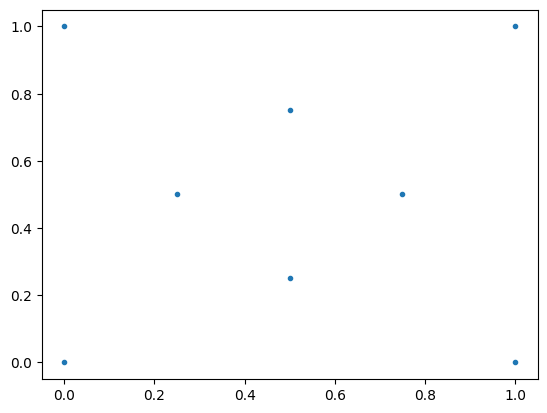
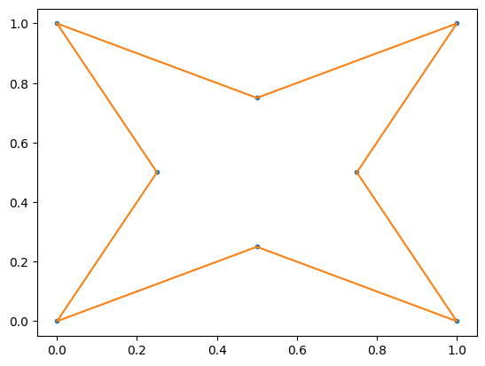
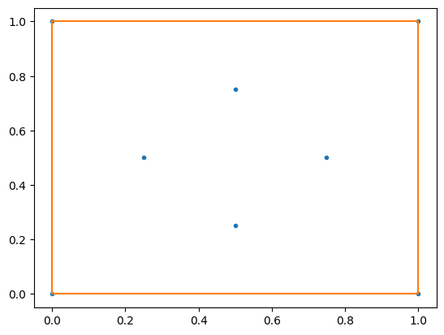
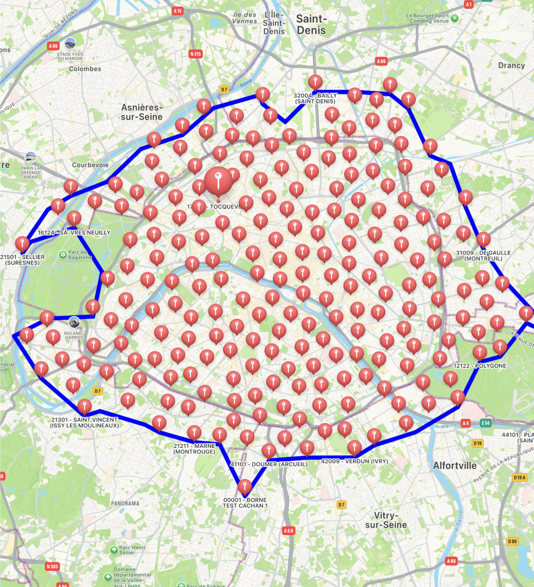

#  uHull

Swift implementation of the uHull python library by Luan Leonardo  https://github.com/luanleonardo/uhull/commits?author=luanleonardo. A simple (but not simpler) algorithm for concave hull of 2D point sets using an alpha shape algorithm.

## Usage

Import the package in your *.swift file:
```swift
import uHull
```

### Quickstart

Concave hull for 2D points
--------------------------

Suppose we want to find a concave hull for the following set of points:



We can find the `polygons` that form the concave hull of the set as
follows:

```swift
import uHull

let points = [
    ASPoint(x: 0.0, y: 0.0),
    ASPoint(x: 0.0, y: 1.0),
    ASPoint(x: 1.0, y: 1.0),
    ASPoint(x: 1.0, y: 0.0),
    ASPoint(x: 0.5, y: 0.25),
    ASPoint(x: 0.5, y: 0.75),
    ASPoint(x: 0.25, y: 0.5),
    ASPoint(x: 0.75, y: 0.5)
]
let polygons = Alpha_Shape().getAlphaShapePolygons(coordinates_points: point, alpha: 1.5)
```

The concave hull obtained for these points is formed by a single polygon
as follows:



Note
----

Two parameters influence the concavity of the concave hull polygons: a
non-negative numerical value `alpha` and the function to measure the
`distance` between the 2D points. By default alpha is set to `1.5` and
the function to measure distance is
[Haversine](https://en.wikipedia.org/wiki/Haversine_formula). The length
of the edges of the polygons generated by the algorithm is calculated
using the informed `distance` function. The `alpha` parameter defines
the size of the range of acceptable values for the length of these edges
that we must consider in the algorithm. Thus, larger alpha considers
larger edges in the algorithm, resulting in a smaller number of polygons
to represent the concave hull and consequently we obtain a less concave
(or, more convex) hull.

As an example, notice that by doubling the default value of alpha, we
get the convex hull:

```swift
import uHull

let points = [
    ASPoint(x: 0.0, y: 0.0),
    ASPoint(x: 0.0, y: 1.0),
    ASPoint(x: 1.0, y: 1.0),
    ASPoint(x: 1.0, y: 0.0),
    ASPoint(x: 0.5, y: 0.25),
    ASPoint(x: 0.5, y: 0.75),
    ASPoint(x: 0.25, y: 0.5),
    ASPoint(x: 0.75, y: 0.5)
]

let polygons = Alpha_shape().getAlphaShapePolygons(coordinates_points: points, alpha: 2 * 1.5)
```



As another example let\'s define a distance function and get concave
hull with it.

```swift
import uHull

func manhattan_distance(coord1: ASPoint, coord2: ASPoint) -> Double {
    return abs(coord1[0] - coord2[0]) + abs(coord1[1] - coord2[1])
}

let points = [
    ASPoint(x: 0.0, y: 0.0),
    ASPoint(x: 0.0, y: 1.0),
    ASPoint(x: 1.0, y: 1.0),
    ASPoint(x: 1.0, y: 0.0),
    ASPoint(x: 0.5, y: 0.25),
    ASPoint(x: 0.5, y: 0.75),
    ASPoint(x: 0.25, y: 0.5),
    ASPoint(x: 0.75, y: 0.5)
]

let polygons = Alpha_shape().getAlphaShapePolygons(coordinates_points:points, distance: manhattan_distance)
```


Example Project uHullExample



## Installation

In Xcode, open `File` -> `Swift Packages` -> `Add Package Dependency` and copy the project url into the text field:

```
https://github.com/swainwri/uHull
```

Or add the following to your `Package.swift` dependencies

```
.Package(url: "https://github.com/swainwri/uHull", majorVersion: 1, minor: 0),
```

As of 2024 the Swift package manager covers all use cases and is super convenient, so we felt that supporting other package managers like Carthage or Cocoapods is no longer necessary.

## License

uHull is available under the MIT license. See the LICENSE file for more info.
